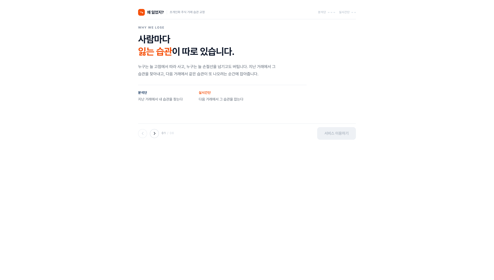
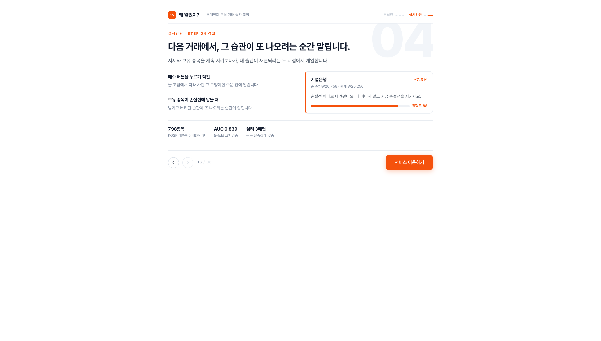
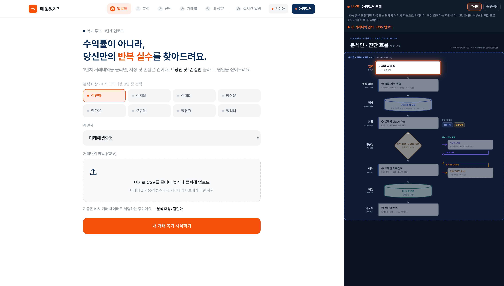
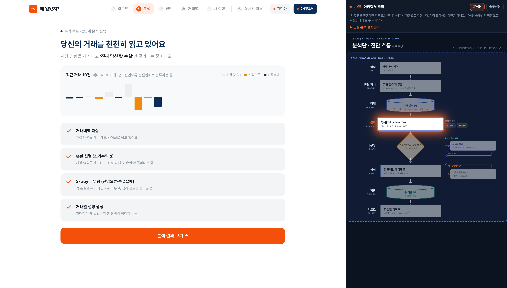
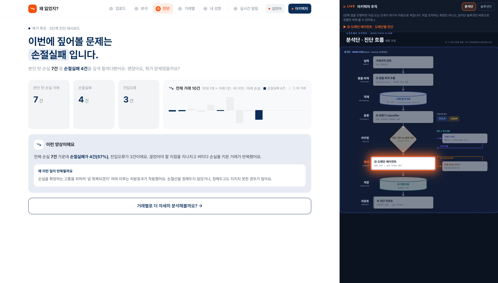
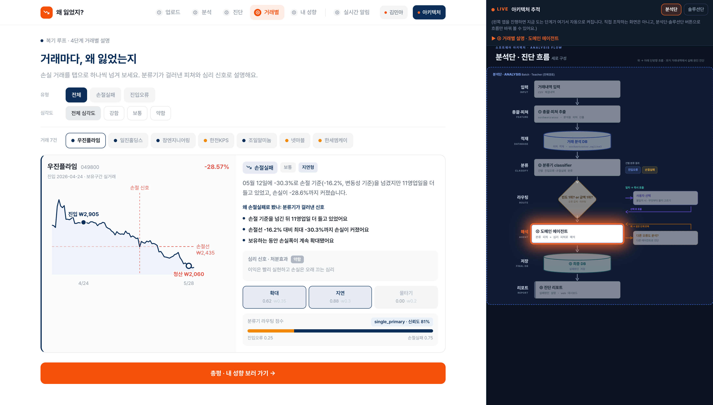
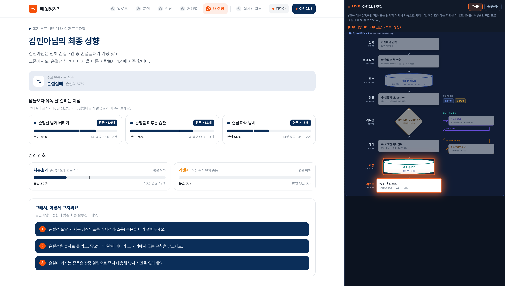
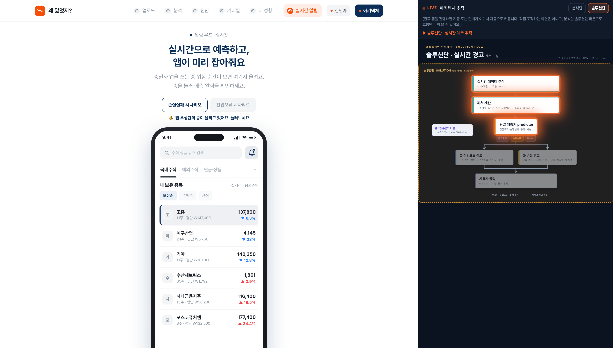
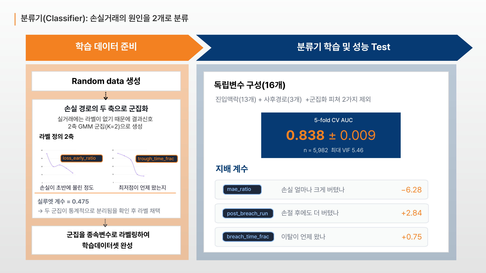
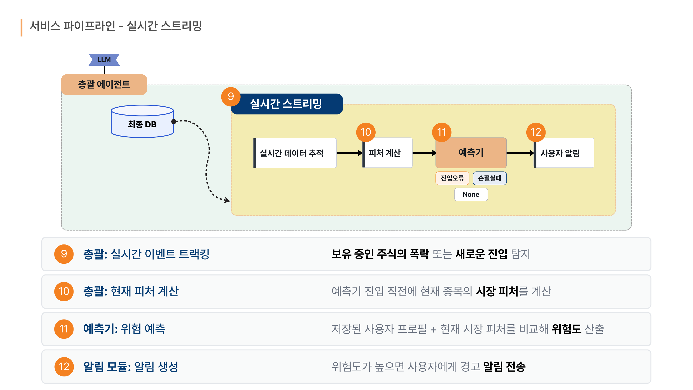

# 2026 금융 AI Challenge 기능 명세서

| | |
|---|---|
| **팀명** | 우왜 |
| **구성원 성명** | 팀장 구준모, 팀원 이수빈, 손영현 |
| **배포 URL** | https://investment-loss-analysis.vercel.app |

> 본 문서에는 배포 URL에서 실제로 동작하는 기능만 기재했습니다. 미구현 기능과 향후 구현 예정 기능은 제외했으며, MVP 단계의 제한사항은 5항에 명시했습니다.

---

## 1. MVP 구현 범위

예선 MVP는 **분석단과 실시간단이 하나의 웹 서비스로 이어져 동작하는 상태**까지 구현했습니다.

### 분석단, 지난 거래에서 습관을 찾는 구간

| 항목 | 구현 내용 |
|---|---|
| 데이터 파이프라인 | KOSPI 798종목 1년치 1분봉 5,467만 행을 수집하고 정제합니다. 체결 내역을 매수에서 매도까지 하나의 사이클로 묶어 피처 16개를 산출하고 분석 DB에 적재합니다. |
| 손실 선별 | 초과손실 α로 시장 성분을 제거하고 복기 대상 손실만 선별합니다. |
| 손실 원인 분류 | 학습된 분류기가 손실 거래마다 진입오류와 손절실패 두 점수를 산출하고, 그 점수만으로 라우팅합니다. |
| 총괄 상호작용 | 유형별 빈도와 손실금액을 집계해 사용자에게 분석 관점을 질문하고, 선택에 따라 도메인 에이전트를 호출합니다. |
| 도메인 에이전트 진단 | 진입오류와 손절실패 각각의 근거로 거래별 원인 설명을 생성합니다. 근거는 피처와 손절선, 이탈 시점, 최대낙폭입니다. |
| 심리 신호 보강 | 리벤지 매매와 처분효과, 과매매를 계산해 진단 설명에 부착합니다. 분류와 라우팅에는 반영하지 않습니다. |
| 성향 리포트 | 반복 패턴을 사용자 프로필 DB에 저장하고 코호트 비교와 교정 규칙을 제시합니다. |

### 실시간단, 저장된 습관으로 다음 거래를 지켜보는 구간

| 항목 | 구현 내용 |
|---|---|
| 습관 프로필 저장 | 분석단이 찾아낸 반복 패턴을 사용자 개인 프로필에 저장합니다. 이 프로필이 실시간 판단의 기준이 됩니다. |
| 손절 경고 | 보유 종목 중 손절선에 근접하거나 이탈한 종목을 선별해 현재가, 손절선, 이탈 시작 시점, 위험도, 근거를 경고 카드로 표시합니다. |
| 진입오류 경고 | 매수 예정 종목의 진입 맥락으로 위험도를 산출해 주문 직전 경고 카드를 표시합니다. |
| 증권사 앱 목업 | 보유 종목 목록과 알림 벨이 있는 앱 화면 위에서 경고가 도착하는 경험을 재현합니다. |

### 공통

| 항목 | 구현 내용 |
|---|---|
| 생성형 AI 문장화 | 거래별 설명, 총괄 질문, 성향 리포트, 경고 문구를 LLM이 작성합니다. |
| 룰 폴백 | LLM 미가용 시 룰 템플릿으로 자동 전환하여 서비스가 중단되지 않습니다. |
| 아키텍처 실시간 추적 | 사용자가 진행 중인 단계가 시스템의 어느 모듈인지 화면 우측 패널에서 실시간으로 점등합니다. |
| 웹 서비스 배포 | 프론트엔드는 Vercel, API 서버는 Render에 분리 배포하여 상시 접속이 가능합니다. |

---

## 2. 주요 기능 목록

| # | 기능명 | 기능 설명 | 관련 화면 | 구현 상태 |
|---|---|---|---|---|
| 1 | 서비스 소개 | 좌우로 넘기는 6장 구성으로 분석단과 실시간단의 흐름을 안내합니다. 초과손실 α 슬라이더와 손실 유형 토글을 직접 조작할 수 있습니다. | 소개 | 구현 완료 |
| 2 | 체험 계정 진입 | 별도 가입 없이 예시 데이터셋으로 전체 흐름을 체험합니다. | 로그인 | 구현 완료 |
| 3 | 데이터 수집 동의 | 거래와 보유 종목 내역의 수집 및 이용 항목을 고지하고 필수 동의를 처리합니다. | 동의 | 구현 완료 |
| 4 | 분석 대상 선택 | 예시 데이터셋 8명 중 1명을 선택해 분석 대상으로 지정합니다. | ① 업로드 | 구현 완료 |
| 5 | 분석 진행 표시 | 거래내역 파싱, 초과손실 α 선별, 2-way 분류, 거래별 설명 생성의 4단계를 순차 표시합니다. 전체 거래 막대 차트에 유형별 색인이 점진적으로 입혀집니다. | ② 분석 | 구현 완료 |
| 6 | 손실 유형 진단 | 전체 손실 건수, 유형별 건수와 손실금액, 우세 유형, 유형 카드를 표시합니다. | ③ 진단 | 구현 완료 |
| 7 | 총괄 상호작용 질문 | 빈도 1위와 손실금액 1위가 엇갈릴 때 무엇부터 볼지 사용자에게 질문하고, 선택에 따라 분석 도메인을 결정합니다. | ③ 진단 | 구현 완료 |
| 8 | 거래별 원인 설명 | 손실 거래를 하나씩 넘겨보며 원인 문장, 분류 근거 피처, 분류기 라우팅 점수와 신뢰도, 심리 신호를 제시합니다. | ④ 거래별 | 구현 완료 |
| 9 | 거래별 복기 차트 | 해당 거래의 실제 1분봉 종가 경로 위에 매수, 청산, 손절선, 손절 신호, 최대낙폭 지점을 마커로 표시합니다. | ④ 거래별 | 구현 완료 |
| 10 | 유형과 심각도 필터 | 거래 목록을 진입오류와 손절실패, 강함과 보통과 약함으로 필터링합니다. | ④ 거래별 | 구현 완료 |
| 11 | 성향 리포트 | 반복 패턴을 카드로 제시하고 10명 평균 대비 발생률과 교정 규칙을 함께 표시합니다. | ⑤ 내 성향 | 구현 완료 |
| 12 | 실시간단 인계 | 분석단 마지막 화면에서 찾아낸 습관이 개인 프로필에 저장되었음을 알리고 실시간 알림 화면으로 연결합니다. | ⑤ 내 성향 | 구현 완료 |
| 13 | 손절 경고 | 보유 종목 중 손절선에 가장 근접하거나 이탈한 종목의 현재가, 손절선, 이탈 시작 시점, 위험도, 근거를 표시합니다. | ⑥ 실시간 알림 | 구현 완료 |
| 14 | 진입오류 경고 | 매수 예정 종목의 진입 맥락 피처로 위험도를 산출해 주문 직전 경고를 표시합니다. | ⑥ 실시간 알림 | 구현 완료 |
| 15 | 증권사 앱 목업 연동 | 보유 종목 목록과 알림 벨이 있는 앱 화면 위에서 경고가 도착하는 경험을 재현합니다. | ⑥ 실시간 알림 | 구현 완료 |
| 16 | 아키텍처 실시간 추적 | 진행 중인 단계의 아키텍처 노드가 자동 점등되고 분석단과 솔루션단 흐름이 자동 전환됩니다. | 전 화면 우측 패널 | 구현 완료 |
| 17 | LLM 문장 생성 | 거래별 설명, 총괄 질문, 성향 리포트, 경고 문구를 생성형 AI가 작성합니다. | ③④⑤⑥ | 구현 완료 |
| 18 | 룰 폴백 | LLM 키 부재나 호출 실패 시 룰 템플릿 문장으로 자동 전환합니다. | ③④⑤⑥ | 구현 완료 |

---

## 3. 사용자 이용 흐름

### 3-1. 순서

```
접속
  https://investment-loss-analysis.vercel.app
     ↓
서비스 소개 6장을 좌우 화살표로 확인
  마지막 장에서 서비스 이용하기 버튼이 활성화됩니다
     ↓
체험 계정으로 둘러보기
     ↓
필수 동의 항목 체크 후 동의하고 시작하기
     ↓
[① 업로드]  예시 데이터셋 8명 중 1명 선택 후 내 거래 복기 시작하기
     ↓
[② 분석]   4단계 자동 진행 약 10초 후 진단 결과 보기
     ↓
[③ 진단]   손실 유형 분포 확인, 무엇부터 볼지 질문에 답변
     ↓
[④ 거래별]  거래를 하나씩 넘겨보며 원인과 1분봉 복기 차트 확인
     ↓
[⑤ 내 성향] 반복 패턴 카드와 교정 규칙 확인 후 실시간 알림 보기
     ↓
[⑥ 실시간 알림] 앱 목업의 알림 벨 클릭 후 경고 카드 확인
```

### 3-2. 화면별 이용 장면


*[그림 1] 소개 화면 1장. 좌우 화살표와 상단 인디케이터로 이동하며, 상단 표시가 분석단과 실시간단으로 나뉘어 있습니다.*


*[그림 2] 소개 화면 6장. 실시간단 설명이며 이 시점에 서비스 이용하기 버튼이 활성화됩니다.*


*[그림 3] ① 업로드. 예시 데이터셋 8명 중 분석 대상을 선택합니다.*


*[그림 4] ② 분석. 4단계가 순차 진행되며 막대 차트에 유형별 색인이 입혀집니다.*


*[그림 5] ③ 진단. 유형별 건수와 손실금액을 확인하고 분석 관점을 선택합니다.*


*[그림 6] ④ 거래별. 1분봉 복기 차트와 분류 근거 피처를 함께 제시합니다.*


*[그림 7] ⑤ 내 성향. 반복 패턴과 10명 평균 대비 발생률을 표시하고, 하단에서 실시간단으로 연결합니다.*


*[그림 8] ⑥ 실시간 알림. 증권사 앱 목업 위에서 손절 경고 카드를 확인합니다.*

### 3-3. 아키텍처 추적 패널

화면 우측 패널은 보기 전용입니다. 사용자가 단계를 진행하면 해당 모듈이 자동으로 점등되며, 상단의 분석단과 솔루션단 버튼으로만 흐름을 바꿔 볼 수 있습니다. 가로 1,680px 이상이면 본문 옆에 나란히 표시되고, 그보다 좁으면 상단 아키텍처 버튼으로 열고 닫습니다.

---

## 4. AI 및 데이터 처리 방식

### 4-1. 학습 기반 분류기

| 항목 | 내용 |
|---|---|
| 역할 | 청산된 손실 거래를 진입오류와 손절실패로 분류 |
| 입력 | 사이클 전체경로 피처 16개. 진입맥락 13개와 사후경로 3개 |
| 출력 | 두 도메인의 점수와 라벨, 신뢰도 |
| 학습 데이터 | 실 KOSPI 1분봉 랜덤샘플과 군집 라벨, 5,986건 |
| 성능 | 5-fold 교차검증 AUC 0.839 ± 0.019 |
| 라벨 생성 | 손실 경로 2축 GMM 군집, 실루엣 계수 0.48 |

라벨을 만든 두 축은 학습 피처에서 제외했습니다. 라벨 생성 신호를 설명에도 사용하면 자기참조가 발생하기 때문입니다.


*[그림 9] 라벨 생성과 분류기 학습 과정*

### 4-2. 예측기

| 모드 | 판단 시점 | 입력 | 출력 |
|---|---|---|---|
| predict_entry_risk | 매수하는 순간 | 진입맥락 피처 | 위험도 점수, 경고 여부, 근거 목록 |
| monitor_live_position | 보유 중 급락 순간 | 미실현손익, 손절선 이탈, 낙폭, 보유시간 | 위험도 점수, 경고 여부, 근거 목록 |

Random Forest와 룰 스코어링의 하이브리드입니다. 트리 개수 120, 최대 깊이 5, 클래스 가중치 balanced로 설정했습니다. 학습 표본이 부족하면 룰 스코어러로 자동 전환되어 경고가 항상 생성됩니다. 두 모드 모두 미래 정보를 사용하지 않습니다.


*[그림 10] 실시간단 파이프라인. 시세 추적, 피처 계산, 예측, 알림 순서로 동작합니다.*

### 4-3. 생성형 AI

사용 모델은 Qwen3-30B-A3B-Instruct입니다.

| 지점 | 입력 | 출력 |
|---|---|---|
| 거래별 원인 설명 | 분류 결과와 근거 피처 | 원인 설명 2~3문장 |
| 총괄 상호작용 | 유형별 빈도와 손실금 집계 | 분석 관점을 묻는 질문 문장 |
| 성향 리포트 | 반복 패턴과 코호트 비율 | 카드 제목, 요약, 교정 팁 |
| 실시간 경고 | 위험 신호와 손절선, 미실현손익 | 경고 메시지 1~2문장 |

적용한 제약은 네 가지입니다. 입력에 없는 수치와 종목을 생성하지 못하도록 금지했고, 분류와 위험도 판정에 개입하지 않으며, 매매 추천과 미래 지시를 금지했고, 호출 실패 시 룰 템플릿으로 자동 폴백합니다.

### 4-4. 룰과 통계 엔진

| 패턴 | 판정 기준 | 근거 |
|---|---|---|
| 처분효과 | PGR과 PLR의 차가 0.05 이상 | Odean 1998년 연구의 실측값 0.148 대 0.098 |
| 과매매 | 연 회전율과 월 거래빈도의 개인 중앙값 대비 배수 | Barber와 Odean 2000년 연구 |
| 리벤지 매매 | 직전 손실 후 임계시간 내 재진입, 포지션 확대, 재손실 | 행동재무 문헌 |

이 신호들은 분류와 라우팅에 가산하지 않고 도메인 에이전트의 해석에만 사용합니다.

### 4-5. 사용 데이터와 입력 및 출력

| 구분 | 내용 |
|---|---|
| 시세 데이터 | KOSPI 798종목 1년치 1분봉 5,467만 행, 3.56GB. 키움증권 REST API로 수집 |
| 수집 기간 | 2025년 6월 23일부터 2026년 6월 23일까지 |
| 제외 종목 | 우선주, ETN, ETF, SPAC, 상장폐지 종목 |
| 거래 데이터 | 체결 내역. 종목명, 거래량, 매수일시, 매도일시 |
| 입력 | 사용자 거래내역과 해당 종목 및 기간의 1분봉 |
| 중간 산출 | 사이클, 초과손실 α, 피처 16개, 분류 점수, 심리 신호 |
| 출력 | 거래별 원인 진단, 유형별 집계, 성향 패턴, 실시간 위험 경고 |
| 저장소 | 분석 DB, 최종 DB, 화면용 차트 캐시 |

배포 환경에는 예시 데이터셋 8명이 실제로 참조하는 134종목 분량 172MB만 탑재했습니다. 응답 속도와 배포 안정성을 확보하기 위한 조치이며, 화면에 표시되는 모든 값은 실제 수집된 1분봉에서 계산됩니다.

### 4-6. 개인정보 및 민감정보 처리

MVP는 실제 개인정보를 수집하거나 저장하지 않습니다. 배포된 서비스는 사전에 준비된 예시 데이터셋 8명만 사용하며 계정 생성과 로그인, 실계좌 연동이 없습니다.

예시 데이터셋의 사용자명은 표시용 라벨이며 계좌번호나 주민등록번호, 연락처 등 개인식별정보를 포함하지 않습니다.

LLM에 전송되는 데이터는 거래 통계 수치와 종목명뿐입니다. 식별정보는 프롬프트에 포함되지 않습니다.

동의 화면은 실서비스 전환 시 필요한 수집 및 이용 항목을 고지하는 UI로 구현되어 있으며, MVP 단계에서 실제 수집은 발생하지 않습니다.

시세 데이터는 공개 시장 데이터이며 개인정보를 포함하지 않습니다.

---

## 5. MVP 검증 방법

### 5-1. 심사자 확인 절차

**필요 계정은 없습니다.** 별도 발급이나 입력 없이 접속 즉시 전체 기능을 확인할 수 있습니다.

| 순서 | 조작 | 예상 결과 |
|---|---|---|
| 1 | https://investment-loss-analysis.vercel.app 접속 | 서비스 소개 화면 표시. 사람마다 잃는 습관이 따로 있습니다라는 제목이 보입니다 |
| 2 | 우하단 오른쪽 화살표를 눌러 6장까지 이동 | 분석단 3장과 실시간단 2장을 확인. 3장의 슬라이더를 움직이면 초과손실 α가 실시간으로 계산됩니다 |
| 3 | 6장에서 활성화된 서비스 이용하기 클릭 | 로그인 화면으로 이동 |
| 4 | 체험 계정으로 둘러보기 클릭 | 데이터 수집 동의 화면으로 이동 |
| 5 | 필수 동의 항목 체크 후 동의하고 시작하기 | ① 업로드 화면으로 이동하고 상단에 6단계 내비게이션이 표시됩니다 |
| 6 | 분석 대상에서 **김민아** 선택 후 내 거래 복기 시작하기 | ② 분석 화면에서 4단계가 약 10초간 순차 진행됩니다 |
| 7 | 진단 결과 보기 클릭 | ③ 진단 화면에 손실 7건, 손절실패 4건 9,965원, 진입오류 3건 12,780원이 표시됩니다 |
| 8 | 제시되는 질문에서 관점 하나 선택 | 빈도 1위는 손절실패, 금액 1위는 진입오류로 엇갈리는 케이스입니다. 시스템이 단정하지 않고 질문하며, 선택한 도메인으로 ④ 거래별 화면으로 이동합니다 |
| 9 | 거래 칩을 하나씩 클릭 | 종목별 1분봉 복기 차트와 원인 설명, 분류기 라우팅 점수가 표시됩니다 |
| 10 | 상단 ⑤ 내 성향 클릭 | 손절선 이탈 후 2일 이상 보유 등 반복 패턴 카드와 10명 평균 대비 발생률이 표시됩니다 |
| 11 | 화면 하단 실시간 알림 보기 클릭 | ⑥ 실시간 알림으로 이동하고 우측 아키텍처 패널이 솔루션단으로 자동 전환됩니다 |
| 12 | 앱 목업 우상단 알림 벨 클릭 | 손절 경고 카드가 표시됩니다. 종목과 현재가, 손절선, 돌파 시점 차트, 위험도 점수, 근거 태그, 경고 문구를 포함합니다 |
| 13 | 진입오류 시나리오 토글 클릭 | 매수 주문 직전 경고 카드로 전환됩니다 |
| 14 | 상단 아키텍처 버튼 토글 | 우측 아키텍처 추적 패널이 열리고 닫힙니다. /architecture 경로로 단독 접근도 가능합니다 |

### 5-2. 샘플 입력값과 예상 결과

입력은 데이터셋 선택뿐이며 텍스트 입력이나 파일 업로드가 필요하지 않습니다.

| 분석 대상 | 예상 결과 |
|---|---|
| **김민아** 권장 | 손실 7건. 손절실패 4건 9,965원, 진입오류 3건 12,780원. 빈도 1위와 금액 1위가 엇갈려 총괄 상호작용 질문이 실제로 발생합니다. 성향 카드는 손절선 이탈 후 2일 이상 보유 2건이며 처분효과 태그가 붙습니다. 손절 경고와 진입오류 경고를 모두 확인할 수 있습니다 |
| 안가은 | 손실 다수. 손절 경고와 진입오류 경고를 모두 확인할 수 있습니다 |
| 김지윤, 김태희, 방상운, 오규원, 장유경, 정리나 | 손실 유형 분포와 성향 패턴을 확인할 수 있습니다. 실시간 알림은 손절실패 시나리오만 표시됩니다 |

**김민아를 권장하는 이유**는 총괄 상호작용 질문과 두 종류의 실시간 경고를 한 사용자에서 모두 확인할 수 있는 유일한 케이스이기 때문입니다. 진입오류 시나리오는 매수 예정 종목이 있는 김민아와 안가은에서만 활성화됩니다.

### 5-3. 실행 환경 및 브라우저 제한사항

| 항목 | 내용 |
|---|---|
| 지원 브라우저 | Chrome, Edge, Safari 최신 버전. 데스크톱 기준으로 검증했습니다 |
| 권장 해상도 | 가로 1,680px 이상. 아키텍처 추적 패널이 본문 우측에 나란히 표시됩니다 |
| 좁은 화면 | 1,680px 미만에서는 패널이 기본으로 닫혀 있으며 상단 아키텍처 버튼으로 열 수 있습니다 |
| 모바일 | 본문 기능은 동작하나 복기 차트와 아키텍처 패널은 데스크톱 기준으로 설계했습니다 |
| 별도 설치 | 없음. 플러그인과 확장 프로그램이 필요하지 않습니다 |
| 접속 계정 | 불필요 |
| 응답 속도 | 모든 화면 2초 이내. 배포 서버는 상시 가동이며 기동 시 무거운 캐시를 미리 적재해 첫 사용자도 대기하지 않습니다 |

### 5-4. MVP 단계의 제한사항

정확한 심사를 위해 현재 단계에서 동작하지 않는 부분을 명시합니다.

**실계좌 연동이 없습니다.** 증권사 계정 연결이나 실시간 잔고 조회는 포함되지 않으며 사전에 준비된 예시 데이터셋으로 동작합니다.

**CSV 파일 업로드 처리는 포함되지 않습니다.** ① 업로드 화면은 실서비스의 진입 경험을 보여주는 UI이며, 실제 분석은 사전 분석된 예시 데이터셋을 선택하는 방식으로 진행됩니다.

**실시간 장중 스트리밍이 아닙니다.** 실시간 알림 화면은 수집된 1분봉을 특정 시점 기준으로 평가한 결과를 보여줍니다. 위험 판정 로직과 경고 생성은 실제로 동작하며 시세 공급 경로만 배치 방식입니다.

**배포 데이터는 134종목으로 한정했습니다.** 예시 데이터셋 8명이 실제 참조하는 종목만 탑재했습니다. 전체 798종목 분석 결과는 동일한 코드로 재현할 수 있습니다.

**인증과 회원 기능이 없습니다.** 로그인 화면은 실서비스 진입 흐름을 보여주는 UI이며 실제 인증은 수행하지 않습니다.

**예측기 성능은 데이터 축적에 따라 변합니다.** 현재 실데이터 기준 AUC는 진입오류 0.51, 손절실패 0.68입니다. 매수 시점에는 미래 정보가 없어 진입오류 예측의 상한이 구조적으로 낮으며, 실사용자 거래 로그가 쌓여야 임계값 보정과 성능 개선이 가능합니다.

**생성형 AI 문장은 외부 API에 의존합니다.** 다만 호출 실패 시 룰 템플릿으로 자동 폴백하므로 어떤 경우에도 화면이 비거나 오류가 노출되지 않습니다.

### 5-5. 재현성

전체 파이프라인과 검증 절차는 공개 저장소에서 재현할 수 있습니다.

| 항목 | 위치 |
|---|---|
| 소스 저장소 | https://github.com/kjms1019/investment-loss-analysis |
| 분류기 학습과 검증 | analysis/label_validation 및 analysis/classifier/train.py |
| 학습 모델 메타 | analysis/classifier/artifacts/entry_stop_clf.meta.json |
| 임계값 근거 문서 | analysis/validation/THRESHOLD_GROUNDING.md |
| 자동화 테스트 | 65개 통과 |
