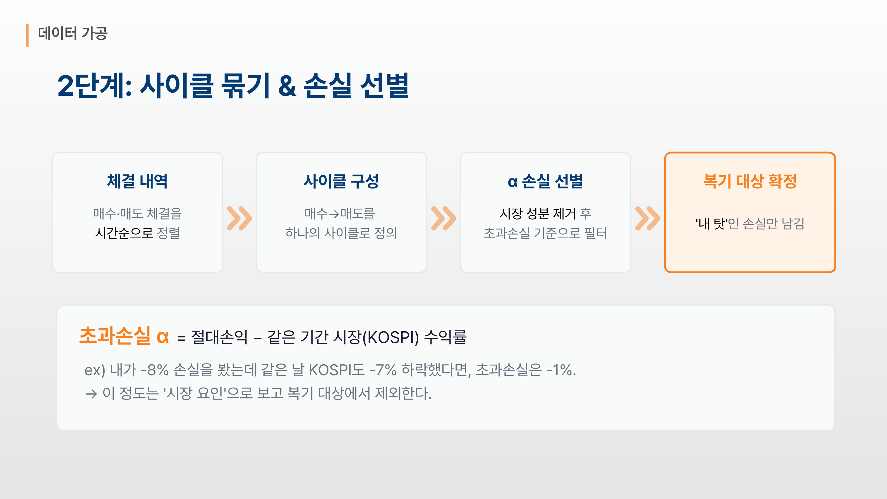
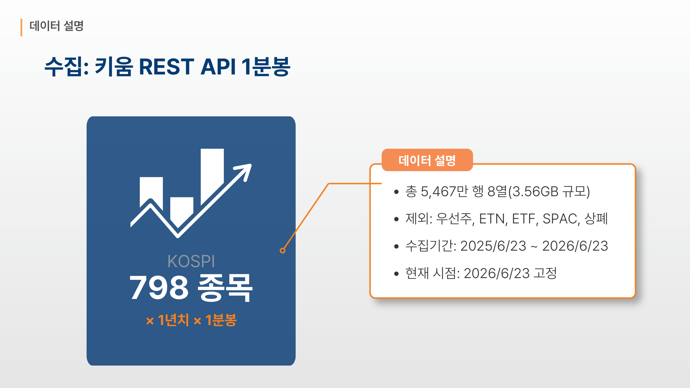
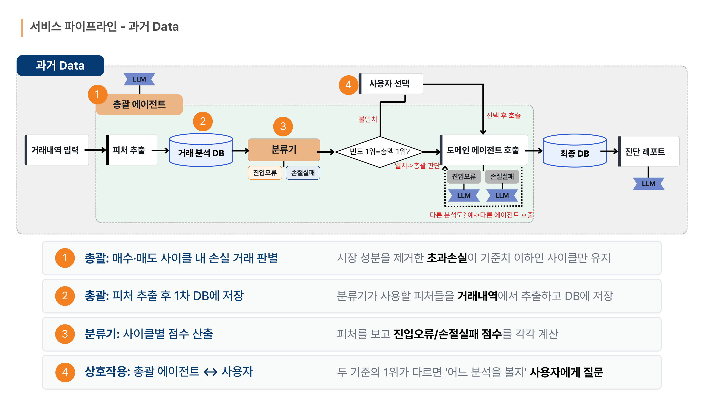
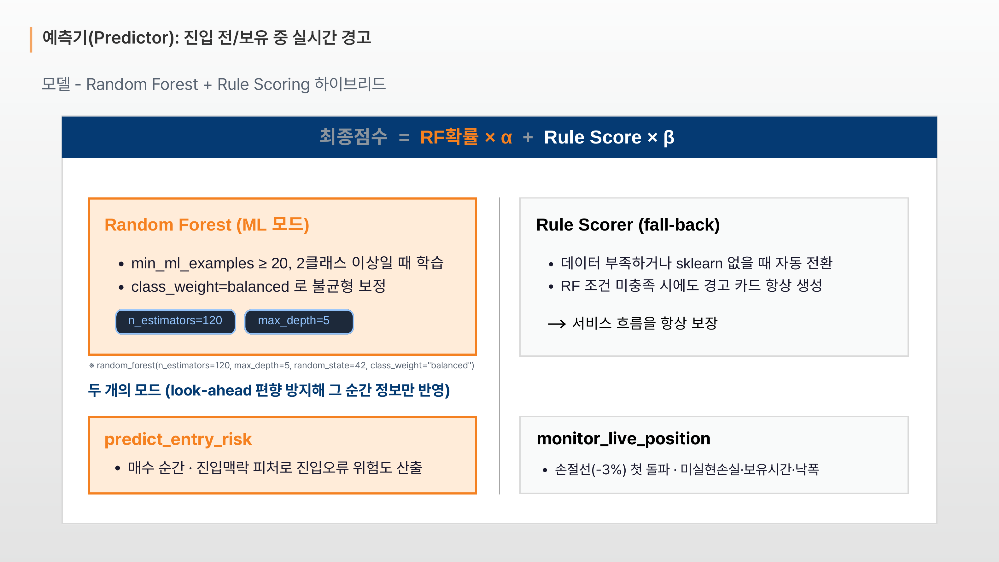
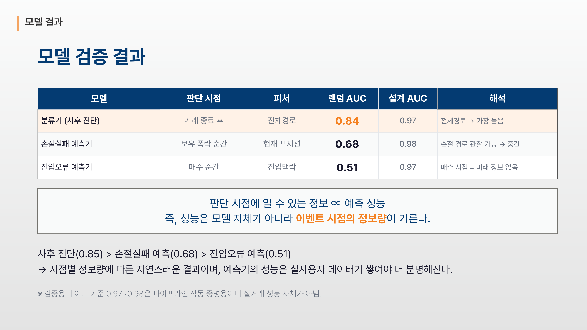
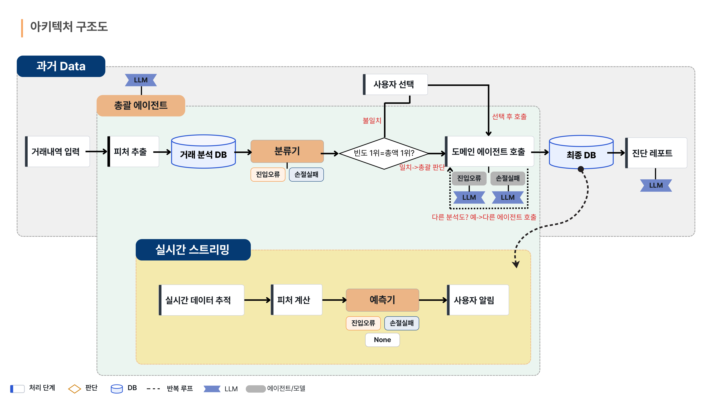

# 2026 금융 AI Challenge 기획서

| | |
|---|---|
| **팀명** | 우왜 |
| **구성원 성명** | 팀장 구준모, 팀원 이수빈, 손영현 |
| **서비스 URL** | https://investment-loss-analysis.vercel.app |

---

## 1. 서비스 명칭

### 우리 왜 잃었지?

거래내역에서 개인의 손실 습관을 찾아내고, 같은 습관이 다음 거래에서 재현되려는 순간에 경고하는 초개인화 습관 교정 서비스입니다.

---

## 2. 아이디어 기획 핵심내용

**문제**

증권사 앱은 얼마를 잃었는지 소수점까지 알려줍니다. 그러나 왜 잃었는지는 알려주지 않습니다. 손실은 기록되는데 이유가 기록되지 않으니 같은 실수가 반복됩니다.

**핵심 관점**

사람마다 잃는 습관이 다릅니다. 누구는 늘 고점에서 따라 사고, 누구는 늘 손절선을 넘기고도 버팁니다. 종목이 왜 떨어졌는지는 이미 여러 서비스가 답하고 있습니다. 저희는 사람을 분석합니다.

**해결 순서**

| 단계 | 하는 일 |
|---|---|
| 포집 | 초과손실 α로 시장 요인을 제거하고 본인 책임인 손실만 남깁니다 |
| 진단 | 그 손실의 원인을 진입오류와 손절실패 두 가지로 가릅니다 |
| 저장 | 반복되는 패턴을 사용자 개인 프로필에 습관으로 남깁니다 |
| 교정 | 다음 거래에서 같은 습관이 재현되려는 순간에 경고합니다 |

**손실 원인을 정의한 두 도메인**

| 도메인 | 무엇이 잘못됐나 | 손실 경로의 특징 |
|---|---|---|
| **진입오류** | 살 때부터 잘못 샀습니다. 고점 추격이나 과열 종목 추격으로 진입한 거래입니다. | 매수 당일부터 손실이 쌓이며 손실이 초반에 몰립니다 |
| **손절실패** | 끊어야 할 때 끊지 못했습니다. 손절선을 이탈했는데 버티거나 물타기로 손실을 키운 거래입니다. | 손절선을 지나 뒤로 갈수록 깊어지며 최저점이 늦게 옵니다 |

두 도메인은 손실 경로의 모양이 서로 다릅니다. 이 차이가 뒤에서 라벨을 만드는 근거가 됩니다.

**설계상의 선택**

- 심리 패턴인 리벤지 매매와 처분효과는 독립 분류가 아닙니다. 두 도메인을 설명하는 보강 신호로만 사용합니다.
- 분석단이 만든 라벨을 예측단의 정답으로 사용합니다. 사후 복기에서 끝나지 않고 실수 직전에 개입합니다.
- 생성형 AI는 수치를 만들지 않습니다. 룰과 모델이 계산한 사실을 문장으로 옮기는 역할만 맡습니다.
- 매매 추천을 하지 않습니다. 사후 복기와 자기 규칙 준수 알림만 제공하여 투자자문 규제 영역을 건드리지 않습니다.

**결과물**

데이터 수집부터 진단 리포트와 실시간 경고까지 하나로 이어지는 웹 서비스를 배포했습니다.


*[그림 1] 서비스 소개 화면. 좌우로 넘기며 분석단과 실시간단의 흐름을 확인할 수 있습니다.*

---

## 3. 문제 정의 및 제안 배경

### 3-1. 현재 금융 서비스의 문제점

**손실 원인에서 개인이 빠져 있습니다.**

기존 손익 리포트는 시장 요인과 개인 요인이 합쳐진 결과만 보여줍니다. 시장이 무너진 날 물린 것인지 본인이 고점에서 추격매수한 것인지 구분되지 않습니다. 원인이 섞여 있으면 교정할 대상도 특정되지 않습니다.

**종목은 분석하지만 사람은 분석하지 않습니다.**

개별 종목의 급등락 요인을 알려주는 서비스는 많습니다. 그러나 누적된 개인의 매매 습관을 짚어주는 서비스는 없습니다. 이 종목이 왜 떨어졌는지에는 답이 있지만, 나는 왜 매번 같은 지점에서 잃는지에는 답이 없습니다.

**그래서 악순환이 끊기지 않습니다.**

오늘 손절하지 못한 사람이 다음 달에 똑같이 물타기를 합니다. 기록되지 않은 실수는 반복됩니다.

### 3-2. 고객 선택 배경

**대상은 거래 이력이 1년 이상 쌓인 국내주식 개인투자자입니다.**

첫째, 데이터가 이미 존재합니다. 증권사는 모든 체결 내역을 보유하고 있고 사용자도 CSV로 내려받을 수 있습니다. 새로 수집할 데이터 없이 기존 데이터에서 새로운 가치를 만들 수 있습니다.

둘째, 진단이 성립하려면 표본이 필요합니다. 한두 번의 손실로는 패턴을 말할 수 없습니다. 1년치 거래가 쌓여야 반복되는 습관을 통계적으로 짚을 수 있습니다.

셋째, 교정 여지가 가장 큽니다. 반복 손실은 정보 부족이 아니라 행동 습관에서 옵니다. 습관은 지적받으면 바뀝니다.

### 3-3. 채널 선택 배경

**최종 형태는 증권사 모바일 앱 안의 기능이고, MVP는 웹으로 구현했습니다.**

손절 경고는 주문 화면에서 울려야 의미가 있습니다. 매수 버튼을 누르기 직전, 보유 종목이 손절선을 건드리는 순간이 개입 지점입니다. 리포트를 따로 열어보게 만드는 서비스는 그 순간을 놓칩니다. MVP에서는 증권사 앱 목업과 웹 대시보드를 함께 제공하여 그 경험을 그대로 보여줍니다.

---

## 4. 서비스 컨셉 및 차별성

### 4-1. 핵심 컨셉

> 기존 서비스는 종목을 분석합니다. 저희는 사람을 분석합니다.

같은 거래내역을 보면서 종목의 등락이 아니라 투자자의 의사결정 지점을 복원합니다. 매수 8분 전에 무슨 일이 있었는지, 손절선을 이탈하고 며칠을 더 버텼는지를 1분봉으로 되돌립니다.

### 4-2. 차별성

**첫째, 시장 요인을 제거한 초과손실 α입니다.**

```
초과손실 α = 절대손익 − 같은 기간 KOSPI 수익률
```

본인이 8% 잃었는데 같은 날 KOSPI도 7% 빠졌다면 초과손실은 1%입니다. 이 정도는 시장 요인으로 보고 복기 대상에서 제외합니다. 이 필터가 없으면 시장이 무너진 날 물린 모든 사람이 실패자로 분류되어 분석 전체가 오염됩니다. 기존 손익 리포트가 하지 않는 첫 번째 작업입니다.


*[그림 2] 초과손실 α를 이용한 복기 대상 선별 과정*

**둘째, 일봉이 아니라 1분봉입니다.**

일봉으로는 그날 물렸다는 사실까지만 보입니다. 1분봉이면 진입 8분 만에 고점 추격이 시작됐다는 사실까지 복원됩니다. 손실의 순간을 분 단위로 되돌려야 그 안에 숨은 실수가 보입니다. 데이터를 많이 모은 것이 아니라 그 해상도라야 진단이 가능하기에 선택한 방식입니다.

**셋째, 분류 근거와 설명 근거가 같은 숫자입니다.**

분류기와 진입오류 에이전트는 동일한 피처 계산 함수를 공유합니다. 분류기가 range_position 0.9로 진입오류를 판정하면, 에이전트도 같은 0.9로 추격매수를 설명합니다. 모델이 판단한 근거와 사용자에게 보여주는 설명이 어긋나지 않습니다.

**넷째, 시스템이 단정하지 않고 사용자에게 묻습니다.**

빈도 1위 유형과 손실금액 1위 유형이 엇갈리면 시스템은 결론을 내리지 않습니다. 자주 반복되는 것과 크게 잃은 것 중 무엇부터 보겠느냐고 사용자에게 묻습니다. 복기의 주도권을 사용자에게 남기는 상호작용 설계입니다.

**다섯째, 습관을 개인 프로필에 저장하여 실시간 판단 기준으로 삼습니다.**

한 번 진단하고 끝나면 다음 달에 똑같이 반복됩니다. 그래서 분석 결과를 리포트로 흘려보내지 않고 사용자 개인 프로필에 습관으로 남깁니다. 같은 5% 하락이어도 손절을 미루는 사람과 고점을 쫓는 사람에게 필요한 경고는 다릅니다. 이것이 초개인화의 실체입니다.

**여섯째, 정직한 성능 보고입니다.**

예측기 AUC는 0.51에서 0.68 사이입니다. 낮아 보이는 숫자를 그대로 보고합니다. 매수하는 순간에는 미래 정보가 없기 때문이고, 이미 보유 중이라 경로가 관찰되면 0.68까지 오릅니다. 성능은 모델이 아니라 판단 시점의 정보량이 가릅니다.

**일곱째, 금융권 망분리를 전제로 한 LLM 구조입니다.**

LLM 호출은 단일 창구로 통일했습니다. 엔드포인트 주소 하나만 바꾸면 클라우드 API에서 사내 vLLM이나 로컬 추론 서버로 전환됩니다. 오픈웨이트 모델을 선택한 이유도 사내 반입 가능성을 우선했기 때문입니다.

---

## 5. 활용 데이터 및 생성형 AI 모델 적용 방안

### 5-1. 활용 데이터

| 구분 | 내용 |
|---|---|
| 시세 데이터 | KOSPI 798종목, 1년치 1분봉, 총 5,467만 행, 3.56GB |
| 수집 경로 | 키움증권 REST API |
| 수집 기간 | 2025년 6월 23일부터 2026년 6월 23일까지 |
| 제외 종목 | 우선주, ETN, ETF, SPAC, 상장폐지 종목 |
| 사용자 데이터 | 증권사 거래내역 CSV. 종목명, 거래량, 매수일시, 매도일시 |
| 파생 데이터 | 사이클별 피처 16개, 심리 패턴 지표, 성향 프로파일 |


*[그림 3] 수집 데이터 규모와 정제 기준*

### 5-2. 데이터 가공 방안

**1단계, 정제**

유동성과 가격 형성이 정상적인 보통주만 남깁니다. 우선주와 ETF, SPAC은 개인의 매매 습관을 왜곡합니다.

**2단계, 사이클 구성**

체결 내역을 시간순으로 정렬해 매수에서 매도까지를 하나의 사이클로 묶습니다. 복기의 최소 단위입니다.

**3단계, 손실 선별**

사이클마다 초과손실 α를 계산해 시장 성분을 제거하고 본인 책임인 손실만 남깁니다.

**4단계, 피처 일괄 계산**

종목명을 종목코드로 매핑한 뒤 1분봉에서 피처 16개를 한 번에 계산해 분석 DB에 적재합니다. 이후 모든 단계는 이 DB를 읽습니다.


*[그림 4] 분석단 파이프라인. 총괄 에이전트가 피처 추출부터 라우팅까지 지휘합니다.*

### 5-3. 피처 구성

피처는 총 16개이며 진입맥락 13개와 사후경로 3개로 나뉩니다.

| 구분 | 피처 |
|---|---|
| 진입맥락 | rsi_14, range_position_20, range_position_60, ret_5m, ret_20m, ret_60m, ret_120m, entry_vs_high20, entry_vs_high60, ma_20_slope, vol_20, vol_60, volume_ratio_20 |
| 사후경로 | post_breach_run, mae_ratio, breach_time_frac |

사후경로 피처 세 개는 각각 손절 이탈 후 얼마나 더 버텼는지, 손실을 어디까지 견뎠는지, 이탈이 언제 왔는지를 나타냅니다.

다중공선성 점검으로 accel과 entry_vs_ma20을 제거했습니다. 최대 VIF는 5.46 이하로 유지됩니다.

군집 라벨을 만든 두 축은 피처에서 제외했습니다. 라벨을 만든 신호를 설명에도 사용하면 자기참조가 발생해 결과를 신뢰할 수 없게 됩니다.

### 5-4. 모델 학습 결과

| 항목 | 값 |
|---|---|
| 학습 소스 | 실 KOSPI 1분봉 랜덤샘플과 군집 라벨 |
| 학습 표본 | 5,986건 |
| 5-fold 교차검증 AUC | **0.839 ± 0.019** |
| 라벨 생성 | 결과신호 2축 GMM 군집, 클러스터 수 2 |
| 군집 분리도 | 실루엣 계수 0.48 |
| 지배 계수 | mae_ratio −7.33, post_breach_run +3.73, breach_time_frac +0.88 |


*[그림 5] 라벨 생성과 분류기 학습 과정. 실거래에 정답 라벨이 없어 손실 경로 2축으로 군집화한 뒤 라벨을 채택했습니다.*

예측기는 Random Forest와 룰 스코어링의 하이브리드입니다. 트리 개수 120, 최대 깊이 5, 클래스 가중치 balanced로 설정했습니다. 학습 표본이 부족하거나 라이브러리를 사용할 수 없는 환경에서는 룰 스코어러로 자동 전환되어 경고 카드가 항상 생성됩니다.


*[그림 6] 예측기의 두 가지 모드. 매수 순간과 보유 중 급락 순간을 각각 판단합니다.*

| 모델 | 판단 시점 | 가용 정보 | 실데이터 AUC |
|---|---|---|---|
| 분류기 | 거래 종료 후 | 전체 경로 | 0.84 |
| 손절실패 예측기 | 보유 중 급락 순간 | 현재 포지션 | 0.68 |
| 진입오류 예측기 | 매수하는 순간 | 진입 맥락만 | 0.51 |

성능 차이는 모델의 우열이 아니라 판단 시점의 정보량 차이입니다.


*[그림 7] 판단 시점별 정보량과 예측 성능의 관계*

### 5-5. 생성형 AI 적용 방안

사용 모델은 Qwen3-30B-A3B-Instruct입니다. OpenAI 호환 규격의 오픈웨이트 모델을 선택했습니다.

**LLM이 수행하는 역할**

| 지점 | 입력 | 출력 |
|---|---|---|
| 거래별 원인 설명 | 분류 결과와 근거 피처 | 손실 원인 2~3문장 |
| 총괄 상호작용 | 유형별 빈도와 손실금 집계 | 분석 관점을 묻는 질문 문장 |
| 성향 리포트 | 반복 패턴과 코호트 비율 | 패턴 카드 제목, 요약, 교정 팁 |
| 실시간 경고 | 위험 신호와 손절선, 미실현손익 | 경고 메시지 1~2문장 |

**LLM에 적용한 제약**

첫째, 수치를 만들지 않습니다. 모든 숫자는 룰 엔진과 모델이 계산합니다. LLM은 계산된 사실만 받아 문장으로 옮깁니다. 입력에 없는 수치나 종목을 생성하지 못하도록 프롬프트에서 금지합니다.

둘째, 분류하지 않습니다. 진입오류와 손절실패 판정은 학습된 분류기가 담당합니다.

셋째, 매매를 추천하지 않습니다. 사후 복기 톤을 유지하고 미래 지시를 금지합니다.

넷째, 없어도 서비스가 동작합니다. API 키가 없거나 호출이 실패하면 룰 템플릿으로 자동 폴백합니다. 심사 기간 중 외부 API가 중단되어도 화면이 비지 않습니다.

**망분리 환경 대응**

LLM 호출은 단일 함수로 통일했고 엔드포인트 주소는 환경변수 하나로 관리합니다. 오픈웨이트 모델이라 사내 반입이 가능하고, 30B MoE 구조에서 활성 파라미터가 3B이므로 폐쇄망 자체 구동이 현실적입니다. 데모는 호스팅 엔드포인트를 사용하지만 동일한 코드로 온프레미스 전환이 가능합니다.


*[그림 8] 전체 아키텍처. 위쪽이 과거 데이터를 다루는 분석단, 아래쪽이 실시간 스트리밍을 다루는 솔루션단입니다.*

---

## 6. 기대 효과 및 확장 가능성

### 6-1. 투자자가 얻는 것

| 지금 | 이 서비스가 바꾸는 것 |
|---|---|
| 이번에도 잃었다는 사실만 남습니다 | 손절선 이탈 후 평균 4영업일을 더 버틴다는 패턴이 특정됩니다 |
| 시장 탓과 본인 탓이 뒤섞여 있습니다 | 초과손실 α로 분리되어 교정 대상만 남습니다 |
| 같은 실수가 반복됩니다 | 매수 직전과 손절선 접근 시점에 사전 경고를 받습니다 |
| 종목 정보만 넘칩니다 | 본인에 대한 진단이 생깁니다 |

핵심 효과는 손실에 이유가 붙는 것입니다. 이유가 붙는 순간 악순환이 끊어집니다.


*[그림 9] 보유 종목이 손절선을 이탈한 시점의 실시간 경고 화면*

### 6-2. 금융 서비스 제공자가 얻는 것

**리텐션이 올라갑니다.** 손익 화면은 잃으면 열기 싫어집니다. 복기 리포트는 잃었을 때 오히려 열어보게 만듭니다. 이탈 구간을 방문 구간으로 바꿉니다.

**대체하기 어려운 차별점이 생깁니다.** 종목 추천은 어느 증권사나 비슷합니다. 내 매매 습관을 짚어주는 앱이라는 인식은 쉽게 따라오지 못합니다.

**규제 리스크가 낮습니다.** 매매 추천이 아니라 사후 복기와 자기 규칙 준수 알림입니다. 투자자문 영역을 건드리지 않습니다.

**추가 데이터 수집이 필요 없습니다.** 이미 보유한 체결 데이터와 시세만으로 동작합니다.

**투자자 보호 실적이 됩니다.** 과도한 회전율과 손절 회피를 사전에 경고하는 것은 감독 방향과도 부합합니다.

### 6-3. 확장 방향

**1단계, 실시간 스트리밍 완성**

현재 판단 엔진과 경고 로직은 완성되어 있고 시세 공급 경로만 배치로 동작합니다. 실시간 스트리밍 러너를 연결하면 장중 상시 감시가 됩니다. 진단이 실제로 맞는지를 먼저 검증했기 때문에 남은 작업은 연결입니다.

**2단계, 실사용자 데이터로 임계값 보정**

현재 임계값은 학술 논문의 정전값과 결과 앵커로 정당화했습니다. 실사용자 거래 로그가 쌓이면 코스피와 연도, 변동성 레짐별로 재보정합니다. 예측기 성능은 이 단계에서 분명해집니다.

**3단계, 자산군 확대**

같은 구조가 해외주식과 ETF, 코인에 그대로 적용됩니다. 사이클 정의와 초과손실 α의 벤치마크 지수만 교체하면 됩니다. 파이프라인 재설계가 필요하지 않습니다.

**4단계, 코호트 비교와 교정 코칭**

다른 사용자 몇 퍼센트도 같은 패턴을 반복한다는 정규화 프레이밍을 이미 리포트에 넣었습니다. 사용자가 쌓이면 유형별 코호트 통계가 생기고 개인화된 교정 규칙으로 이어집니다.

### 6-4. 금융 외 영역 응용

이 서비스의 일반적 형태는 결과 로그에서 반복되는 의사결정 실패를 자동 진단하고 재발 직전에 개입하는 시스템입니다. 도메인 특수성은 초과손실 α와 피처 정의에만 있고 골격은 그대로 옮겨집니다.

| 영역 | 진단 대상 | 개입 시점 |
|---|---|---|
| 소비와 신용 | 결제 로그의 반복 과소비와 리볼빙 패턴 | 결제 직전 |
| 보험 | 사고와 청구 이력의 반복 위험 행동 | 갱신 시점 |
| 헬스케어 | 복약과 검진 기록의 이탈 패턴 | 이탈 직전 |
| 교육 | 오답 로그의 반복 오개념 | 같은 유형 문제 직전 |
| 산업 안전 | 작업 로그의 반복 위반 | 동일 상황 재발 시 |

결과만 기록되고 이유가 기록되지 않는 모든 로그가 대상입니다.

---

## 7. 설계에서 스스로에게 지운 제약

무엇을 하지 않기로 했는지가 이 시스템의 신뢰 근거입니다.

**라벨을 저희가 만든 규칙으로 만들지 않았습니다.**

실거래에는 정답 라벨이 없습니다. 라벨을 튜닝하려는 규칙으로 만들면 자기 가정을 되찾을 뿐입니다. 그래서 라벨은 결과신호 군집으로 만들고, 군집 수의 정당성을 실루엣 계수 0.48로 먼저 확보한 뒤, 라벨 축을 제외한 피처로 분류기를 학습했습니다. 라벨을 만드는 쪽과 채점하는 쪽을 분리했습니다.

**임계값을 임의로 정하지 않았습니다.**

룰의 임계값은 학술 논문의 정전값에 앵커링했습니다. 처분효과 기준인 PGR과 PLR의 차 0.05는 Odean 1998년 연구의 실측값 0.148 대 0.098과 일치합니다. 과매매는 Barber와 Odean 2000년 연구, 리벤지 매매는 행동재무 문헌에 근거합니다. 정전값이 없는 피처는 근거가 없다는 사실을 문서에 그대로 남겼습니다.

**합성 데이터 성능을 실력으로 주장하지 않았습니다.**

설계 합성 데이터에서는 AUC 0.97에서 0.98이 나옵니다. 이 숫자는 파이프라인이 작동한다는 증명일 뿐 실거래 성능이 아닙니다. 배포 모델은 실 KOSPI 1분봉 랜덤샘플로 학습한 AUC 0.839 기준입니다.

**심리 신호를 라우팅에 섞지 않았습니다.**

리벤지와 처분효과 신호를 분류 점수에 가산하면 성능이 좋아 보입니다. 그러나 같은 신호를 라우팅과 설명 양쪽에 사용하면 순환이 발생합니다. 심리는 해석 전용으로 격리했습니다.

**낮은 숫자를 감추지 않았습니다.**

진입오류 예측기 AUC 0.51을 그대로 보고합니다. 매수 순간에는 미래 정보가 없으므로 이것이 정직한 상한에 가깝습니다.

---

## 부록. 배포 정보

| 항목 | 값 |
|---|---|
| 서비스 URL | https://investment-loss-analysis.vercel.app |
| API 서버 | https://investment-loss-analysis.onrender.com |
| 소스 저장소 | https://github.com/kjms1019/investment-loss-analysis |
| 프론트엔드 | Next.js, Vercel 배포 |
| 백엔드 | FastAPI, Python 3.13, Render 배포 |
| LLM | Qwen3-30B-A3B-Instruct, OpenAI 호환 엔드포인트 |
| 자동화 테스트 | 65개 통과 |
